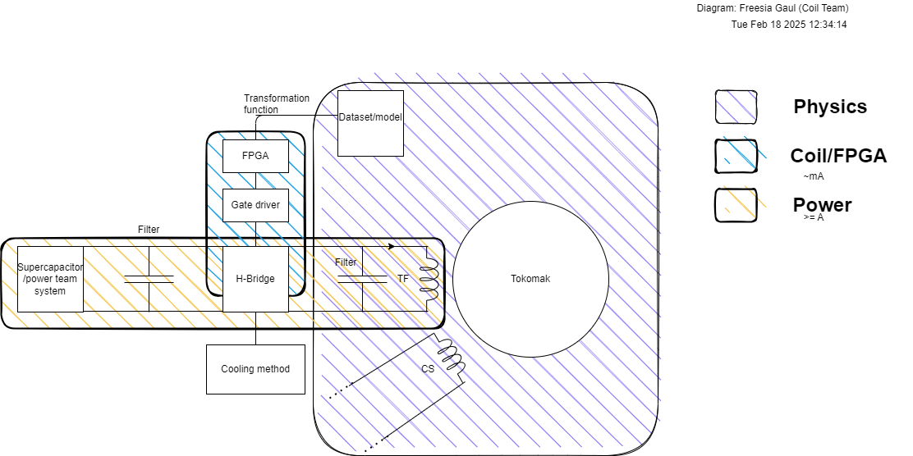
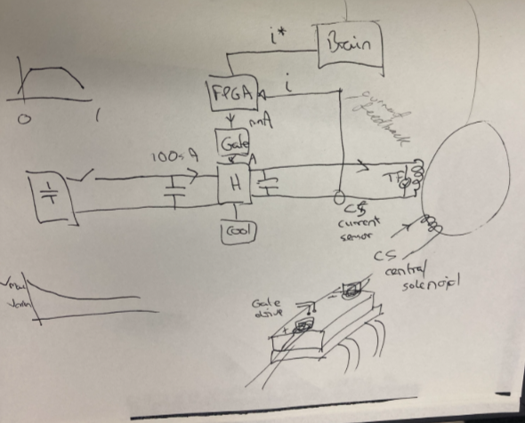

# Project Overview Conversation

### Physics, Power, and Coil Team

---

#### Overview

Gary, Harrison (Team lead,) and Freesia were having a discussion about timings and amperage values, algorithms, and relevant job allocations across the project. Gary raised that it would be a good idea to leave the H-Bridge as a task for the power team - keeping tasks delegated to the level of amperage of that part of the system. Freesia (a new member) asked for a diagram of the project, when seeing it, Harry and Freesia agreed with Gary (as more skill in that domain is with the power team, therefore being a natural fit.) This would decrease our workload, but would be a more efficient allocation based on skill.
   
Another question was raised in relation to the FPGA design - Freesia knew that the FPGA was necessary for the speeds we are working at, but suggested leveraging the hardware more for it's parallel capabilities - after reading the prototype code provided by Shrinil. This was in relation to getting a dataset/model from the physics team. She said that while we can feed values provided by the physics team into the algorithm, it may also provide value to be reading parts of the system for outlier fluctuations to adjust our outputs in case of results not seen from past data. This would increase our workload later into the project, but would assist in error handling later on.

---

#### Summary:

##### Physics Team:

- VALUES: Must communicate and agree on a rough value/interval to avoid overfitting/underfitting algorithms. We need to know how strong the magnetic field is so that the circuit values can be adjusted to handle this.
   

##### Power Team:

- H-BRIDGE AND ALLOCATIONS: Talk to the power team about distributing the system based on the level of amperage, as it makes sense to keep these seperated to groups to avoid scope creep and not having the necessary skill in a team to deliver effective results.

---

